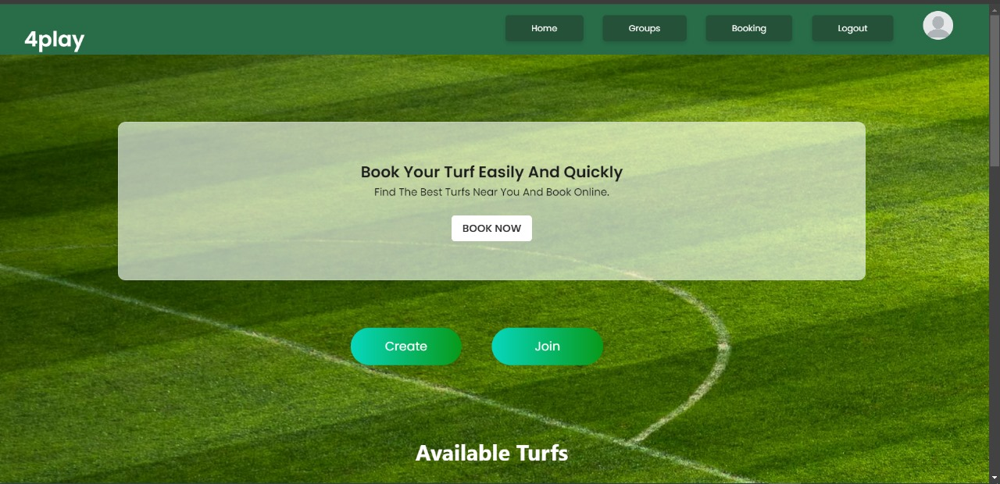
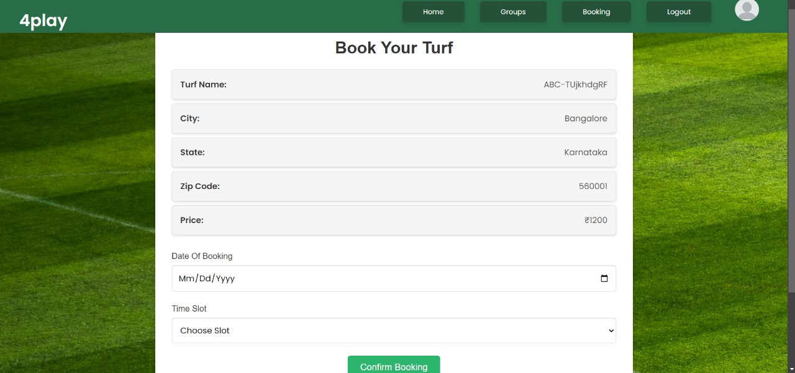
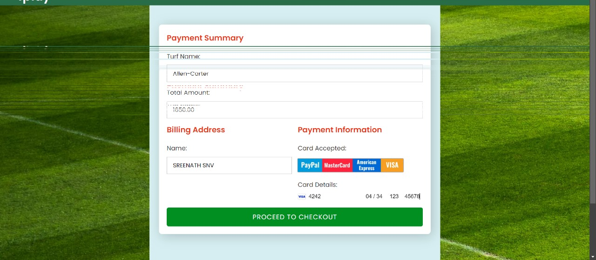
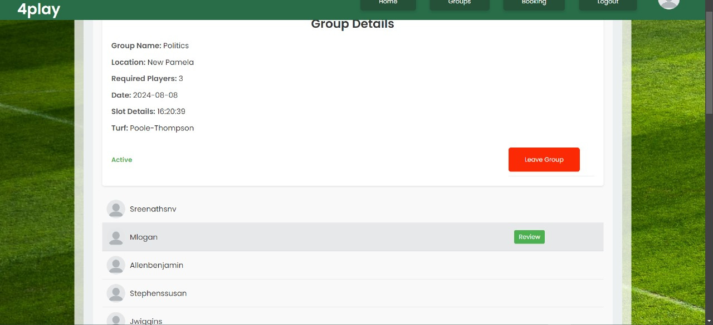
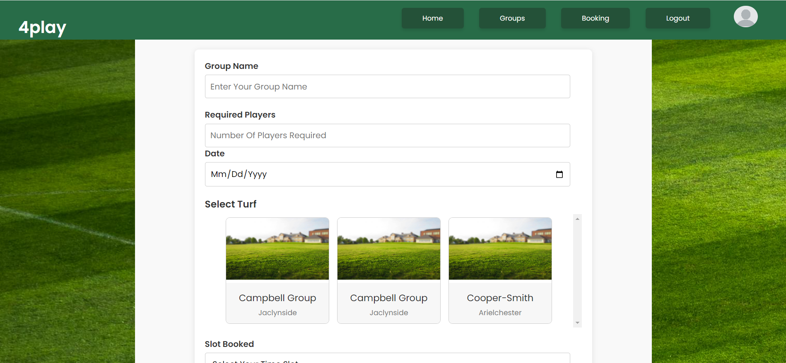
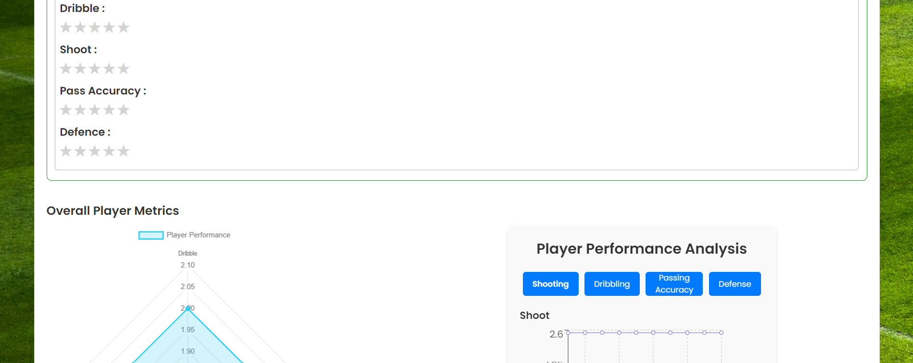
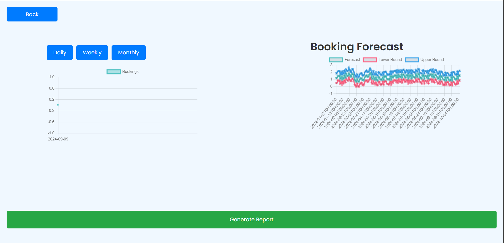

# Turf Reservation and Player Analysis Platform

## Overview

This platform is designed to streamline turf reservations and provide advanced player analysis features. It caters to both turf owners and players by offering an easy-to-use interface for booking, reviewing, and interacting within the community.

## Features

- **Turf Booking and Canceling Facilities**: Users can reserve and manage their turf bookings seamlessly.
- **Review and Rating System**: Players can review and rate both turfs and fellow players after matches, promoting quality and reliability.
- **Community Rooms**: Dedicated spaces for players to interact, form teams, and discuss matches.
- **Advanced Caching with Redis**: Implemented Redis to enhance platform performance through efficient data caching.
- **Secure Payment Processing with Stripe**: Integrated Stripe to handle payments securely and efficiently.
- **Enterprise-Level Authentication with Djoser**: Used Djoser for handling user authentication with a high level of security.
- **Player Analysis with Aroma**: Provides detailed performance analysis of players using the Aroma platform.

## Technologies Used

- **Backend**: Python, Django
- **Frontend**: React
- **Caching**: Redis
- **Payment Gateway**: Stripe
- **Authentication**: Djoser
- **Player Analysis**: Aroma and more


## Screenshots

### Home Page


### Booking Page


### Payment Page


### Group overview


### Create Room


### User profile


### Admin profile


## Installation

1. **Clone the repository**:
    ```bash
    https://github.com/sreenathsnv/Turf-reservation
    cd turf-reservation
    ```

2. **Backend Setup**:
    - Navigate to the backend directory:
      ```bash
      cd backend
      ```
    - Create a virtual environment and activate it:
      ```bash
      python3 -m venv venv
      source venv/bin/activate
      ```
    - Install the required dependencies:
      ```bash
      pip install -r requirements.txt
      ```
    - Apply migrations:
      ```bash
      python manage.py migrate
      ```
    - Run the server:
      ```bash
      python manage.py runserver
      ```
3. **Generating Dummy data**:
    - Generating the data for every models:
      
      ```bash
      python manage.py generate
      ```
    - Genarating data for a particular model :
        - *Go to the backend directory*
        - *Go to the turfapp/management/commands*
        - *Where you can see many dummy_modelname.py files*
        - *Run the command with the given format : *
        -Eg python manage.py dummy_users
      ```bash
      python manage.py command_filename_without_(.py)
      ```
    - Start the development server:
      ```bash
      npython manage.py runserver
      
4. **Frontend Setup**:
    - Navigate to the frontend directory:
      ```bash
      cd frontend/turf-client
      ```
    - Install the required dependencies:
      ```bash
      npm install
      ```
    - Start the development server:
      ```bash
      npm run dev
      ```
5. **Redis Setup**:
    - **Linux/macOS**:
      - Install Redis:
        ```bash
        sudo apt update
        sudo apt install redis-server
        ```
      - Start Redis server:
        ```bash
        sudo systemctl start redis-server
        ```
      - Enable Redis to start on boot:
        ```bash
        sudo systemctl enable redis-server
        ```
    - **Windows**:
      - Download the latest Redis release from [Redis for Windows](https://github.com/microsoftarchive/redis/releases).
      - Extract the downloaded ZIP file and navigate to the extracted folder.
      - Run the Redis server by executing:
        ```bash
        redis-server.exe
        ```
      - Keep the Redis server running in a separate terminal window.
      
    - **Django Redis Configuration**:
      - Add the following to your `settings.py`:
        ```python
        CACHES = {
            'default': {
                'BACKEND': 'django_redis.cache.RedisCache',
                'LOCATION': 'redis://127.0.0.1:6379/1',
                'OPTIONS': {
                    'CLIENT_CLASS': 'django_redis.client.DefaultClient',
                }
            }
        }
        ```

5. **Environment Variables Setup**:

    - **Backend Environment Variables**:
      - Create a `.env` file in your backend directory and add the following configuration:
        ```bash
        EMAIL_PORT=587
        EMAIL_HOST_USER=your_app_email
        EMAIL_HOST_PASSWORD=your_password
        STRIPE_SECRET_KEY=your_stripe_secret_key
        STRIPE_PUBLISH_KEY=your_stripe_publish_key
        SITE_URL=http://localhost:5173/
        ```
        - Replace `your_app_email` with the email address used for sending emails.
        - Replace `your_password` with the app-specific password generated from your email provider (e.g., Gmail: Manage Account -> Security -> App Passwords).
        - Replace `your_stripe_secret_key` and `your_stripe_publish_key` with the respective keys from your Stripe account.

    - **Frontend Environment Variables**:
      - Create a `.env` file in your frontend directory and add the following configuration:
        ```bash
        VITE_BACKEND_URL=http://localhost:8000
        VITE_STRIPE_PUBLISH_KEY=your_stripe_publish_key
        ```
        - Replace `your_stripe_publish_key` with the respective key from your Stripe account.


## Usage

- Visit the homepage and register/login using the authentication system.
- Explore available turfs and make bookings.
- Interact with other players in community rooms.
- Rate and review turfs and players after matches.
- Analyze player performance through detailed insights.

## Contributing

Contributions are welcome! Please fork the repository and submit a pull request for any improvements or feature additions.

## License

This project is licensed under the MIT License. See the `LICENSE` file for more details.

## Contact

For any inquiries or support, feel free to reach out at [sreenathsnvaltpb@gmail.com](mailto:sreenathsnvaltpb@gmail.com) \
[josephpallathukudy@gmail.com](mailto:josephpallathukudy@gmail.com)\
[sarath.baburaj@mca.christuniversity.in](mailto:sarath.baburaj@mca.christuniversity.in) \
[athul.raja@mca.christuniversity.in](mailto:athul.raja@mca.christuniversity.in) 
